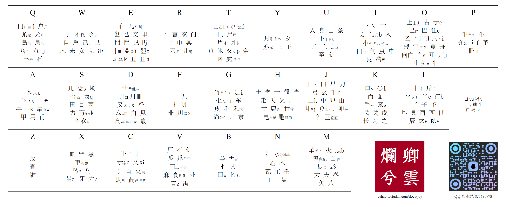
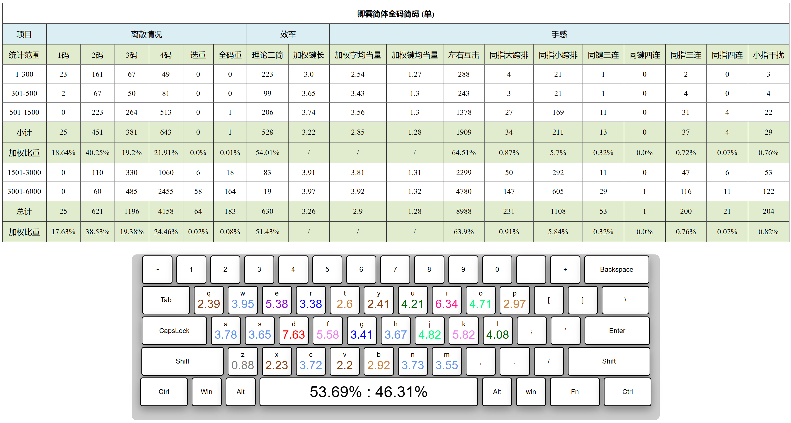

<!-- omit in toc -->
# 卿雲爛兮

{: .no_toc }

  

    目录
  

  {: .text-delta }
1. TOC
{:toc}

{: .warning }
本方案基于宇浩拆分，为 25.5 键乱序单编、繁简通打方案。初始学习难度较大，请务必充分了解、分析、平衡其风险和收益后再决定是否学习使用。

## 简介

卿雲爛兮是[宇浩输入法](http://zhuyuhao.com/yuhao/)的**乱序单编**衍生方案。方案名取自《尚書大傳》之「卿雲爛兮，糺縵縵兮」。取码规则共两条：

1. 依次取第一、二、三、末字根对应的编码；
2. 不足四码时，输入一个补码，即末根读音。

所以，根据字根数量，有以下几种形式。设首根为 A，次根为 B，三根为 C，末根为 Z，读音为 v。

1. 单根字：Zv
2. 双根字：AZv
3. 三根字：ABZv
4. 多根字：ABCZ

本方案的**补码**，是末根的读音首字母，没有读音则默认为 v。唯一的例外是高频「口」字根，虽然读音为 k，但当作没有读音处理。

{: .highlight }
卿云取码歌诀  
一二三末取字根　单根成字即自身  
双根便作首和末　三根首二同末存  
字根表中找编码　二十五键莫看岔  
依次填入根字母　不足四码加补码  
补码就是末根音　以下法则心里记  
鱼化ｖ来衣作ｉ　口补ｖ外无特例  

| 末根补码 | 规则                     | 举例                    |
| :------- | :----------------------- | ----------------------- |
| v        | 频率最高的字根，补码为 v | 口                      |
| v        | 读音为 ㄩ 的，补码为 v   | 鱼魚雨禺予 月曰         |
| i        | 读音为 ㄧ 的，补码为 i   | 一乙已乂弋亦衤 言羊用夭 |

字根是有限的，因此本方案依旧是纯形方案，不是形音方案。

本方案**繁简通打**，其关键数据如下：

- 简体动态选重率 0.079%
- 繁体动态选重率 0.079%
- 繁简混合动态选重率 0.134%
- 全码速度当量 1.27，简码速度当量 1.28
- 单字平均双手互击率 > 65%，连续文本双手互击率 > 45%

以下为本方案的字根图。有可能作为末根的生僻部首，图上标注其读音，以供参考：

## 优缺点

本方案编码**乱序**，200多个字根的在25键上随机出现，相比「光華」「星陳」两个方案，优缺点都十分突出，故总结如下：

### 缺点

- 初始学习难度较大，同键位字根之间的字形关系不强，难以进行相似字形联想记忆。
- 双根字全码为三码，对于大字集来说，静态重码较高。
- 双根字需要按空格，无法四码顶屏，因此拇指压力增大，不适合腱鞘炎患者。

### 优点

- 字形相近的部首在键盘上离散。因此，字根编码中可以包含更多信息，使得规则的复杂度较低。
- 编码随机分布，有利于分散双手互击，提高理论击键速度当量。
- 补码严格取字根读音，对于日常使用拼音或注音的人比较友好。

## 数据

### 全码重码

| 形码方案 | 简体选重率 | 繁体选重率 | 繁简混合文本选重率 | GB2312 | 国字常用 | GBK  | CJK-B | CJK-D | CJK-F | CJK-H | CJK-I |
| :------- | :--------- | :--------- | :----------------- | :----- | :------- | :--- | :---- | :---- | :---- | :---- | :---- |
| 五笔86   | 34.2‱      | 77.7‱      | 238.3‱             | 521    | 333      | 6453 | NA    | NA    | NA    | NA    | NA    |
| 五笔98   | 31.8‱      | 79.5‱      | 240.0‱             | 515    | 330      | 6378 | NA    | NA    | NA    | NA    | NA    |
| 五笔06   | 31.8‱      | 83.8‱      | 236.3‱             | 532    | 387      | 6610 | NA    | NA    | NA    | NA    | NA    |
| 蓝宝石2  | 21.6‱      | 57.3‱      | 58.4‱              | 388    | 284      | NA   | NA    | NA    | NA    | NA    | NA    |
| 蓝宝石3  | 9.7‱       | NA         | NA                 | 392    | NA       | NA   | NA    | NA    | NA    | NA    | NA    |
| 郑码     | 59.0‱      | 83.6‱      | 262.8‱             | 559    | 316      | 6631 | NA    | NA    | NA    | NA    | NA    |
| 真码     | 7.0‱       | 60.1‱      | 273.7‱             | 422    | 238      | NA   | NA    | NA    | NA    | NA    | NA    |
| 徐码     | 10.7‱      | 22.8‱      | 24.9‱              | 318    | 127      | 2902 | 25605 | 27956 | 35746 | NA    | NA    |
| 宇浩光华 | 4.3‱       | 15.1‱      | 15.7‱              | 320    | 198      | 5168 | 33249 | 35910 | 44530 | 50686 | 51139 |
| 宇浩星陈 | 8.0‱       | 10.9‱      | 15.1‱              | 415    | 149      | 4932 | 33192 | 36024 | 45002 | 51688 | 52179 |
| **卿雲** | 7.9‱       | 7.9‱       | 13.4‱              | 539    | 448      | 186  | 6108  | 36912 | 39955 | 49402 | 56333 | 56847 |
| 云码     | 4.8‱       | 6.5‱       | 10.5‱              | 287    | 97       | 3877 | 29902 | 32503 | 40870 | 46990 | 47429 |
| 天码     | 10.8‱      | 27.5‱      | 63.8‱              | 489    | 316      | 5777 | 33860 | 36692 | 45591 | 52240 | 52720 |

### 二简重码

| 形码方案 | 简体选重率 | 繁体选重率 | 繁简混合文本选重率 | GB2312 | 国字常用 | GBK  | CJK-B | CJK-D | CJK-F | CJK-H | CJK-I |
| :------- | :--------- | :--------- | :----------------- | :----- | -------: | :--- | :---- | :---- | :---- | :---- | :---- |
| 五笔86   | 21.8‱      | 69.0‱      | 168.5‱             | 451    |      293 | 6111 | NA    | NA    | NA    | NA    | NA    |
| 蓝宝石   | 5.2‱       | 36.9‱      | 30.7‱              | 301    |      245 | NA   | NA    | NA    | NA    | NA    | NA    |
| 郑码     | 24.5‱      | 47.7‱      | 152.2‱             | 460    |      283 | 6405 | NA    | NA    | NA    | NA    | NA    |
| 真码     | 6.1‱       | 59.6‱      | 262.0‱             | 412    |      234 | NA   | NA    | NA    | NA    | NA    | NA    |
| 徐码23   | 9.1‱       | 19.0‱      | 19.1‱              | 353    |      119 | 2871 | 25378 | 27721 | 35456 | NA    | NA    |
| 宇浩光华 | 3.4‱       | 14.0‱      | 13.9‱              | 297    |      174 | 5026 | 32933 | 35584 | 44171 | 50310 | 50761 |
| 宇浩星陳 | 6.2‱       | 9.5‱       | 12.8‱              | 362    |      129 | 4736 | 32809 | 35622 | 44546 | 51209 | 51701 |
| **卿雲** | 7.9‱       | 7.8‱       | 13.3‱              | 534    |      442 | 182  | 6092  | 36883 | 39926 | 49372 | 56302 | 56816 |
| 雲碼     | 3.5‱       | 5.5‱       | 7.8‱               | 259    |       85 | 3735 | 29522 | 32105 | 40433 | 46539 | 46976 |
| 山人全息 | 5.0‱       | 38.1‱      | 141.1‱             | 499    |      266 | 4430 | 15894 | 17707 | NA    | NA    | NA    |

### 世界名著选重

| 方案     | 毛泽东选集(简) | 天龙八部(简) | 三体三部曲(简) | 战争与和平(简) | 史記(繁) | 紅樓夢(繁) | 笑傲江湖(繁) | 論語集解(繁簡混) | 三國演義(繁簡混) | 海上花列傳(繁簡混) |
| :------- | :------------- | :----------- | :------------- | :------------- | :------- | :--------- | :----------- | :--------------- | :--------------- | :----------------- |
| 五笔86   | 25.8‱          | 30.6‱        | 25.7‱          | 20.9‱          | 88.4‱    | 28.9‱      | 46.7‱        | 260.8‱           | 360.8‱           | 244.6‱             |
| 五笔98   | 31.3‱          | 28.4‱        | 26.5‱          | 33.2‱          | 69.3‱    | 32.5‱      | 48.8‱        | 265.7‱           | 374.8‱           | 242.5‱             |
| 五笔06   | 22.2‱          | 25.5‱        | 24.3‱          | 37.1‱          | 79.7‱    | 35.3‱      | 49.2‱        | 252.5‱           | 345.7‱           | 232.7‱             |
| 蓝宝石2  | 18.4‱          | 20.5‱        | 24.9‱          | 18.1‱          | 43.8‱    | 25.3‱      | 29.9‱        | 20.5‱            | 52.7‱            | 35.6‱              |
| 郑码     | 44.2‱          | 51.6‱        | 49.2‱          | 48.1‱          | 89.9‱    | 39.2‱      | 32.2‱        | 266.7‱           | 385.9‱           | 311.2‱             |
| 真码     | 5.3‱           | 14.0‱        | 5.6‱           | 6.9‱           | 45.3‱    | 16.6‱      | 16.4‱        | 298.4‱           | 411.4‱           | 333.9‱             |
| 徐码23   | 3.3‱           | 9.8‱         | 7.0‱           | 7.8‱           | 22.1‱    | 10.9‱      | 9.1‱         | 10.3‱            | 39.2‱            | 22.7‱              |
| 矧码     | 5.3‱           | 21.0‱        | 11.3‱          | 17.1‱          | 48.0‱    | 19.4‱      | 29.0‱        | 37.1‱            | 78.8‱            | 54.6‱              |
| 宇浩光华 | 1.2‱           | 2.9‱         | 2.7‱           | 2.4‱           | 25.9‱    | 9.2‱       | 6.5‱         | 4.4‱             | 24.5‱            | 9.6‱               |
| 宇浩星陈 | 3.5‱           | 6.4‱         | 2.3‱           | 6.2‱           | 31.5‱    | 9.1‱       | 7.3‱         | 3.9‱             | 30.9‱            | 17.7‱              |
| **卿雲** | 2.7‱           | 7.5‱         | 4.7‱           | 5.6‱           | 25.3‱    | 7.3‱       | 5.9‱         | 4.9‱             | 23.7‱            | 11.1‱              |
| 云码     | 1.1‱           | 3.1‱         | 4.1‱           | 6.6‱           | 15.5‱    | 3.9‱       | 2.8‱         | 7.8‱             | 21.8‱            | 13.1‱              |
| 天码     | 6.0‱           | 8.7‱         | 6.9‱           | 7.5‱           | 38.0‱    | 18.8‱      | 13.7‱        | 50.3‱            | 75.2‱            | 56.8‱              |
| 倉頡五代 | 74.0‱          | 71.1‱        | 80.2‱          | 60.0‱          | 74.6‱    | 33.0‱      | 30.9‱        | 67.4‱            | 144.6‱           | 88.3‱              |
| 蒼颉六代 | 62.5‱          | 65.0‱        | 61.0‱          | 43.1‱          | 69.3‱    | 16.4‱      | 14.2‱        | 38.6‱            | 129.6‱           | 83.4‱              |
| 山人全息 | 2.4‱           | 6.8‱         | 5.6‱           | 6.1‱           | 20.8‱    | 6.3‱       | 3.2‱         | 281.3‱           | 352.3‱           | 314.7‱             |

### 词派最大选重率

使用字（单字词）词（多字词）混合词频计算。

| 方案     | 简体文本 | 繁体文本 | 混合文本 |
| :------- | :------- | :------- | :------- |
| 蓝宝石3  | 45.9‱    | NA       | NA       |
| 蓝宝石2  | 48.4‱    | 89.3‱    | 199.0‱   |
| 云码     | 103.1‱   | 106.7‱   | 245.3‱   |
| **卿雲** | 107.3‱   | 111.6‱   | 295.8‱   |
| 宇浩光華 | 116.0‱   | 129.3‱   | 311.7‱   |
| 徐码23   | 116.3‱   | 131.2‱   | 316.7‱   |
| 天码     | 117.9‱   | 118.6‱   | 357.1‱   |
| 宇浩星陳 | 127.2‱   | 144.4‱   | 302.6‱   |
| 五筆86   | 204.1‱   | 235.6‱   | 750.2‱   |
| 五筆98   | 204.2‱   | 242.7‱   | 733.5‱   |
| 五筆06   | 217.8‱   | 238.3‱   | 749.6‱   |

### 速度当量

| 方案          | 簡體速度當量 | 繁體速度當量 | 繁簡速度當量 |
| :------------ | -----------: | -----------: | -----------: |
| **卿雲·26键** |       1.2664 |       1.2588 |       1.2626 |
| 吉旦餅·26键   |       1.2796 |       1.2973 |       1.2885 |
| 雲碼·26键     |       1.3008 |       1.3058 |       1.3033 |
| 宇浩星陳·26键 |       1.3017 |       1.3058 |       1.3038 |
| 蓝宝石·25键   |       1.3079 |       1.3302 |       1.3191 |
| 宇浩光華·25键 |       1.3224 |       1.3347 |       1.3286 |
| 山人全息·26键 |       1.3249 |       1.3349 |       1.3299 |
| 倉頡五代·25键 |       1.3343 |       1.3368 |       1.3356 |
| 真码·25键     |        1.339 |       1.3607 |       1.3499 |
| 郑码·26键     |       1.3451 |       1.3473 |       1.3462 |
| 五筆86·25键   |        1.354 |       1.3592 |       1.3566 |
| 五筆98·25键   |       1.3587 |       1.3643 |       1.3615 |
| 五筆06·25键   |       1.3636 |       1.3655 |       1.3646 |
| 徐码23·26键   |       1.3865 |       1.3679 |       1.3772 |
| 天碼·26键     |       1.3962 |       1.3868 |       1.3915 |

### 连续文本双手互击比例

| 方案            | 均值   | 毛泽东选集(简) | 天龙八部(简) | 三体三部曲(简) | 战争与和平(简) | 史記(繁) | 紅樓夢(繁) | 笑傲江湖(繁) | 論語集解(繁簡) | 三國演義(繁簡) | 海上花列傳(繁簡) |
| :-------------- | :----- | :------------- | :----------- | :------------- | :------------- | :------- | :--------- | :----------- | :------------- | :------------- | :--------------- |
| **卿雲·26键**   | 46.46% | 47.48%         | 48.13%       | 47.30%         | 47.97%         | 44.40%   | 45.31%     | 46.87%       | 47.01%         | 44.43%         | 45.72%           |
| 三码吉旦餅·26键 | 43.27% | 43.44%         | 43.91%       | 44.49%         | 44.48%         | 42.19%   | 42.71%     | 44.08%       | 44.36%         | 41.84%         | 41.21%           |
| 蓝宝石2·25键    | 42.85% | 44.54%         | 44.17%       | 44.30%         | 43.97%         | 40.77%   | 42.02%     | 43.08%       | 44.94%         | 40.51%         | 40.17%           |
| 雲碼·26键       | 41.97% | 43.52%         | 42.45%       | 42.84%         | 43.29%         | 42.45%   | 41.27%     | 42.01%       | 39.71%         | 41.26%         | 40.91%           |
| 宇浩星陳·26键   | 40.26% | 40.59%         | 40.49%       | 40.89%         | 41.62%         | 38.22%   | 40.25%     | 40.49%       | 40.40%         | 38.69%         | 40.93%           |
| 倉頡五代·25键   | 40.10% | 40.22%         | 40.24%       | 39.96%         | 41.12%         | 39.13%   | 39.82%     | 41.12%       | 39.41%         | 39.24%         | 40.71%           |
| 蓝宝石3·25键    | 38.75% | 38.00%         | 39.91%       | 38.12%         | 38.14%         | 37.54%   | 39.57%     | 41.33%       | 37.71%         | 38.76%         | 38.41%           |
| 真码·25键       | 38.61% | 40.38%         | 39.67%       | 40.56%         | 39.15%         | 37.69%   | 38.62%     | 38.32%       | 36.51%         | 37.76%         | 37.43%           |
| 郑码·26键       | 38.54% | 36.70%         | 38.86%       | 38.56%         | 39.12%         | 38.90%   | 37.98%     | 37.92%       | 39.50%         | 38.53%         | 39.29%           |
| 宇浩光華·25键   | 38.42% | 39.29%         | 38.65%       | 39.06%         | 38.04%         | 37.07%   | 38.86%     | 38.05%       | 39.65%         | 38.15%         | 37.42%           |
| 徐码23·26键     | 37.97% | 37.92%         | 37.61%       | 37.35%         | 37.17%         | 38.56%   | 37.99%     | 37.00%       | 39.06%         | 38.51%         | 38.57%           |
| 山人全息·26键   | 36.16% | 36.39%         | 36.53%       | 36.24%         | 36.68%         | 36.09%   | 35.58%     | 35.79%       | 37.18%         | 35.46%         | 35.68%           |
| 天碼·26键       | 35.59% | 35.38%         | 35.78%       | 34.77%         | 36.00%         | 34.93%   | 35.80%     | 36.65%       | 35.91%         | 35.20%         | 35.51%           |
| 五筆98·25键     | 35.41% | 36.96%         | 35.90%       | 37.58%         | 37.05%         | 34.31%   | 34.98%     | 34.35%       | 33.56%         | 35.48%         | 33.99%           |
| 五筆06·25键     | 35.32% | 36.96%         | 35.54%       | 37.24%         | 37.11%         | 34.24%   | 35.04%     | 34.25%       | 33.70%         | 35.08%         | 34.01%           |
| 五筆86·25键     | 34.30% | 36.46%         | 35.01%       | 36.62%         | 35.88%         | 33.24%   | 34.60%     | 33.44%       | 30.95%         | 33.63%         | 33.12%           |

### 虎码测评网

以下为虎码测评网的结果。

## 同光华星陈对比

各个维度上一个大致的排名：

- 简体白话文：光华 > 星陈 ≈ 卿云
- 繁体白话文：卿云 ≈ 光华 ≈ 星陈
- 繁简白话文：光华 ≈ 卿云 > 星陈
- 古代文言文：星陈 > 光华 > 卿云
- 字根容易度：星陈 > 光华 > 卿云
- 规则容易度：卿云 > 星陈 ≈ 光华
- 手感舒适度：卿云 > 星陈 > 光华

| 特点                       | 光華 | 星陳 | 卿雲 |
| :------------------------- | :--- | :--- | :--- |
| 使用最新版本宇浩拆分       | ✅    | ✅    | ✅    |
| 繁简通打低极选重率 (<0.2%) | ✅    | ✅    | ✅    |
| 字根字重复小码             | ✅    | ✅    | ❌    |
| 两根字取首根小码           | ✅    | ✅    | ❌    |
| 大码使用 Z 键              | ❌    | ❌    | ❌    |
| 小码使用 Z 键              | ❌    | ✅    | ✅    |
| 相似字形字根同分区聚类     | ✅    | ❌    | ❌    |
| 相似字形字根同大码聚类     | ❌    | ✅    | ❌    |
| 小码 >85% 使用拼音首字母   | ❌    | ✅    | ✅    |
| 小码 >99% 使用拼音首字母   | ❌    | ❌    | ✅    |
| 双手互击率 >60%            | ❌    | ✅    | ✅    |
| 严格优化键位分布           | ❌    | ✅    | ✅    |
| Z 键反查                   | ✅    | ✅    | ✅    |

## 作者

钱多多，为主要策划人、项目发起人、测试员、制图员、皮肤设计者、社区维护者。

forFudan，提供字根排布计算和技术支持。
